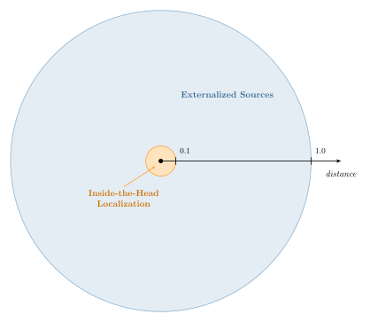

# Binaural Rendering

This document describes the technical details of how audio elements are processed and rendered binaurally.

## Encoding to Ambisonics

Channel and object-based audio elements are encoded into an intermediate Ambisonic bed using spherical harmonic (SH) coefficients. The encoding is based on the [AssociatedLegendrePolynomialsGenerator](https://github.com/resonance-audio/resonance-audio/blob/master/resonance_audio/ambisonics/associated_legendre_polynomials_generator.h) class from [Resonance Audio](https://github.com/resonance-audio/resonance-audio/).

Ambisonic audio elements pass through directly without re-encoding. The rendering filter order matches the input:
- **1OA–4OA inputs** — Rendered using filters of the same order
- **Channel/object inputs** — Encoded to 3rd Order Ambisonics, then rendered with 3OA filters

## Ambisonics to Binaural

The Ambisonic bed is decoded to binaural stereo using Head Related Impulse Responses (HRIRs) and Binaural Room Impulse Responses (BRIRs) decomposed into SH coefficients. The FIR convolution is based on the [AmbisonicBinauralDecoder](https://github.com/resonance-audio/resonance-audio/blob/master/resonance_audio/ambisonics/ambisonic_binaural_decoder.h) class from [Resonance Audio](https://github.com/resonance-audio/resonance-audio/). Asymmetric processing provides dedicated filters for left and right ears. Filter matrices are loaded from embedded assets.

### Filter Profiles

Three binaural filter profiles control the acoustic character of the output:

- **Direct** — Anechoic HRIRs for precise localization and minimal coloration
- **Ambient** — Moderate room reflections for a natural sense of space (recommended default)
- **Reverberant** — Stronger room response for enhanced spaciousness and externalization

### Filter Specifications

The following table summarizes the binaural filter lengths per SH channel at 48 kHz:

| Filter Type | Filter Length (samples) | Sampling Rate |
|:------------|:-----------------------:|:-------------:|
| Direct      |           256           |    48 kHz     |
| Ambient     |          8192           |    48 kHz     |
| Reverberant |          8192           |    48 kHz     |

## Object Distance Rendering

Distance handling for object-based audio elements (`kObjectMono`, `kObjectDual`) is applied as follows:

- **Distance 0.1 to 1.0** — Treated as 1.0; no distance-based processing is applied
- **Distance less than 0.1** — Gradual attenuation of higher-order spherical harmonics, introducing an inside-the-head localization effect

## Passthrough Audio Elements

The following audio element types bypass binaural processing and head tracking entirely, passing input directly to stereo output:

- **kPassthroughMono** — Single channel copied to both L and R outputs. Use for mono signals or 0th Order Ambisonics (0OA)
- **kPassthroughStereo** — Stereo input passed directly to stereo output. Use for static binaural content or non-spatialized stereo

The peak limiter is applied to passthrough elements.
