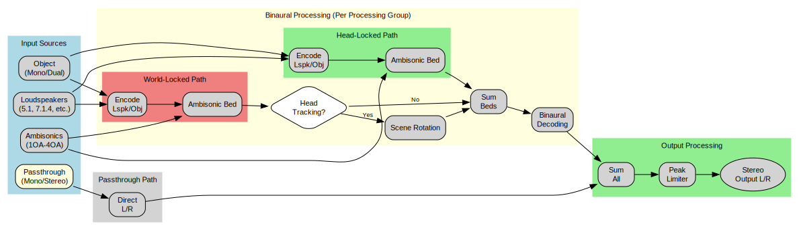

# Signal Flow

The renderer processes audio elements through parallel paths based on their type and head-locked setting.

## Overview

## Signal Flow Details

### 1. Passthrough Processing

`kPassthroughMono` and `kPassthroughStereo` elements bypass all binaural processing and head tracking, being mixed directly to stereo output.

### 2. Processing Groups

Audio elements are automatically organized into different binaural processing groups based on their Ambisonic order and binaural filter profile (Direct, Ambient, or Reverberant). Elements within the same group share DSP resources including the Ambisonic encoder, rotator, and binaural decoder.

### 3. Binaural Processing (Per Processing Group)

For each processing group, elements are processed through dual Ambisonic mix beds:

#### PASS 1 (World-Locked)
Loudspeaker and object channels with `head_locked=false` are encoded to Ambisonics, then mixed with world-locked Ambisonic input channels into the world-locked Ambisonic bed.

#### PASS 2 (Head-Locked)
Loudspeaker and object channels with `head_locked=true` are encoded to Ambisonics, then mixed with head-locked Ambisonic input channels into the head-locked Ambisonic bed.

#### Head Tracking Rotation
If head tracking is enabled, only the world-locked bed is rotated by the inverse of head orientation, creating the effect of world-stabilized sound sources.

#### Mixing
Both world-locked and head-locked beds are summed together.

#### Binaural Decoding
The combined Ambisonic bed is decoded to binaural output using the appropriate filters for the group's Ambisonic order and filter profile (Direct/Ambient/Reverberant).

### 4. Output Processing

The binaural output from all processing groups is mixed with passthrough audio, and by default processed through a peak limiter before being written to the output buffer.
